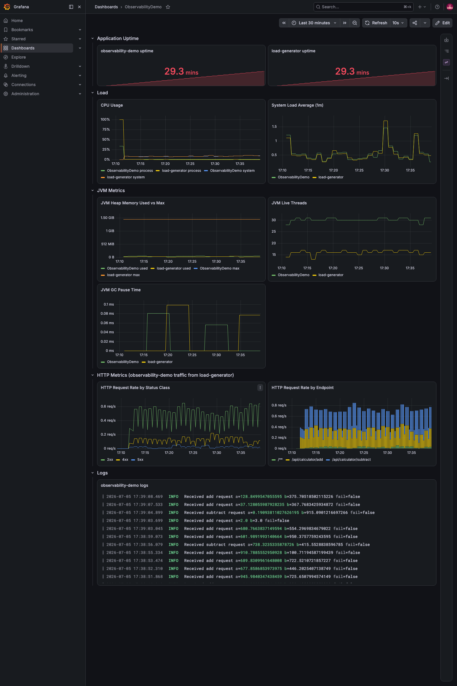
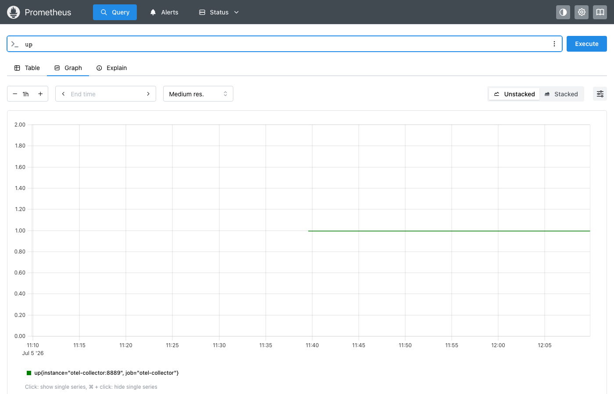
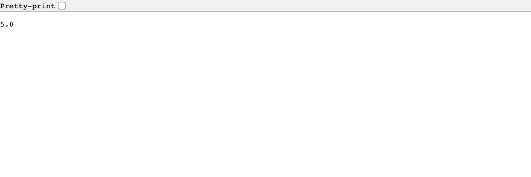

# ObservabilityDemo

A minimal Spring Boot application demonstrating an end-to-end observability stack: metrics, logs, traces, dashboards, and traffic generation, all wired together with OpenTelemetry, Prometheus, Loki, Tempo, and Grafana.

## Architecture

```
load-generator ──HTTP──▶ calculator-service ──HTTP──▶ rounding-service
                                │                             │
             (all three apps, OTLP: metrics + logs + traces)
                                │
                                ▼
                          otel-collector
                                │
                ┌───────────────┼───────────────┐
                ▼                ▼               ▼
           Prometheus          Loki            Tempo
        (scrapes metrics)  (logs via OTLP)  (traces via OTLP)
                │                │               │
                └───────────────┼───────────────┘
                                ▼
                             Grafana
                (dashboards over all three datasources)
```

- **calculator-service** — Spring Boot app exposing a simple calculator REST API (`/api/calculator/add`, `/api/calculator/subtract`). Before computing a result, it calls `rounding-service` to round both operands to 2 decimal places. Emits metrics, logs, and traces over OTLP.
- **rounding-service** — Spring Boot app exposing a rounding REST API (`/api/rounding/round`) that rounds two numbers to a given number of decimal digits. Emits metrics, logs, and traces over OTLP.
- **load-generator** — Spring Boot app that continuously calls the calculator API at randomized intervals/values to produce steady traffic (and emits its own metrics).
- **otel-collector** — Receives OTLP metrics/logs/traces from all three apps, exposes metrics for Prometheus to scrape, forwards logs to Loki, and forwards traces to Tempo.
- **Prometheus** — Scrapes metrics from the otel-collector.
- **Loki** — Stores logs shipped from the otel-collector.
- **Tempo** — Stores distributed traces shipped from the otel-collector.
- **Grafana** — Pre-provisioned with Prometheus + Loki + Tempo datasources and an `ObservabilityDemo` dashboard.

`calculator-service`'s call to `rounding-service` propagates the W3C `traceparent` header, so each request produces a single distributed trace spanning both services (visible as one trace with spans from both `calculator-service` and `rounding-service` in Tempo/Grafana), rather than two disconnected traces.

## Prerequisites

- Docker and Docker Compose

(Java/Gradle are only needed if you want to build or run the apps outside of Docker — the toolchain requires JDK 25, but Gradle will provision it automatically via `./gradlew`.)

## Running the stack

From the repository root:

```bash
docker compose up --build
```

This starts all eight services: `calculator-service`, `rounding-service`, `load-generator`, `otel-collector`, `prometheus`, `loki`, `tempo`, and `grafana`.

To stop everything:

```bash
docker compose down
```

## Exposed ports

| Service            | Port | URL                                      |
|--------------------|------|-------------------------------------------|
| calculator-service | 8080 | http://localhost:8080                     |
| rounding-service   | 8081 | http://localhost:8081                     |
| Grafana            | 3000 | http://localhost:3000                     |
| Prometheus         | 9090 | http://localhost:9090                     |
| Loki               | 3100 | http://localhost:3100 (queried via Grafana) |
| Tempo              | 3200 | http://localhost:3200 (queried via Grafana) |
| otel-collector     | 4317 / 4318 | gRPC / HTTP OTLP receiver endpoints |
| otel-collector      | 8889 | http://localhost:8889/metrics (Prometheus scrape endpoint) |

## Viewing metrics and logs

1. Open Grafana at **http://localhost:3000** (default login: `admin` / `admin`).
2. Open the **ObservabilityDemo** dashboard (auto-provisioned, no manual import needed). It includes:
   - **Application Uptime** — uptime for `calculator-service`, `rounding-service`, and `load-generator`.
   - **Load** — CPU usage and system load average (all apps).
   - **JVM Metrics** — heap memory, live threads, GC pause time (all apps).
   - **HTTP Metrics (calculator-service)** — request rate by status class and by endpoint (traffic generated by `load-generator`).
   - **HTTP Metrics (rounding-service)** — request rate by status class and by endpoint (traffic generated by `calculator-service`'s internal calls).
   - **Logs** — live application logs from `calculator-service` and `rounding-service`, side by side.
   - **Traces** — recent distributed traces for `calculator-service` and `rounding-service` from Tempo; each row links to the full trace view (with spans from both services).



You can also query the datasources directly:
- **Prometheus** UI at http://localhost:9090 to run PromQL queries against the metrics otel-collector exposes.
- **Grafana Explore** (using the `Loki` datasource) to run LogQL queries against application logs.
- **Grafana Explore** (using the `Tempo` datasource) to run TraceQL queries against traces, e.g. `{resource.service.name="calculator-service"}`.



## Exercising the API manually

With the stack running, you can call the calculator API directly:

```bash
curl "http://localhost:8080/api/calculator/add?a=2&b=3"
curl "http://localhost:8080/api/calculator/subtract?a=5&b=1"
```

Pass `fail=true` to simulate an error response and see it reflected in the logs/metrics:

```bash
curl "http://localhost:8080/api/calculator/add?a=2&b=3&fail=true"
```



The `load-generator` service does this automatically in the background at randomized intervals, so the dashboard will show live traffic without any manual calls.

`calculator-service` calls `rounding-service` internally on every request to round the operands first. You can also call `rounding-service` directly (it isn't driven by `load-generator`):

```bash
curl "http://localhost:8081/api/rounding/round?a=3.14159&b=2.71828&roundedUpto=2"
```

## Configuration

- `load-generator` behavior (target URL, request delay range, value range) is configured via `load-generator/src/main/resources/application.yaml`, and can be overridden with environment variables (see `LOAD_GENERATOR_TARGET_BASE_URL` in `docker-compose.yml`).
- `calculator-service`'s `rounding-service` URL is configured via `rounding-service.base-url` in `calculator-service/src/main/resources/application.yaml` (defaults to `http://rounding-service:8080`), and can be overridden with the `ROUNDING_SERVICE_BASE_URL` environment variable.
- OTLP export endpoints for all three apps are configured in their respective `application.yaml` files, pointing at the `otel-collector` service. Trace sampling is set to 100% (`management.tracing.sampling.probability`) so every request produces a trace.
- Collector pipelines (metrics → Prometheus, logs → Loki, traces → Tempo) are defined in `otel-collector-config.yaml`. Tempo's own OTLP receiver config is in `tempo-config.yaml`.

## Running components individually (without Docker)

```bash
# calculator-service
cd calculator-service && ./gradlew bootRun

# rounding-service
cd rounding-service && ./gradlew bootRun

# load-generator
cd load-generator && ./gradlew bootRun
```

Note: all three apps default to OTLP endpoints pointing at `otel-collector` (Docker service name), so running them standalone requires either the rest of the stack to also be up via `docker compose up otel-collector prometheus loki grafana`, or overriding the OTLP/target URLs to point at `localhost`.

## Running tests

```bash
cd calculator-service && ./gradlew test
cd rounding-service && ./gradlew test
cd load-generator && ./gradlew test
```
